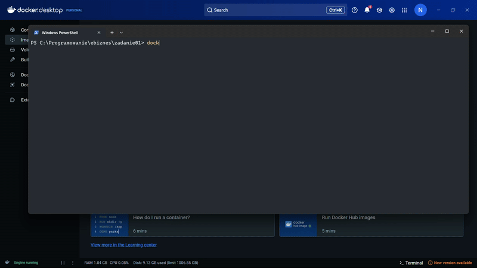

# Ebiznes

### Zadanie 1

- obraz ubuntu 24.04
- python 3.10
- kotlin
- gradle
- java 8
- build.gradle z SQLite
  - buduje program typu Hello World w javie
- docker-compose

Obraz -> [dockerhub](https://hub.docker.com/r/noxikoxi/my-java-app)

