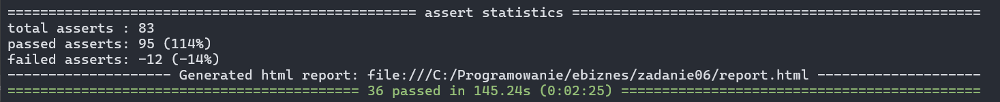
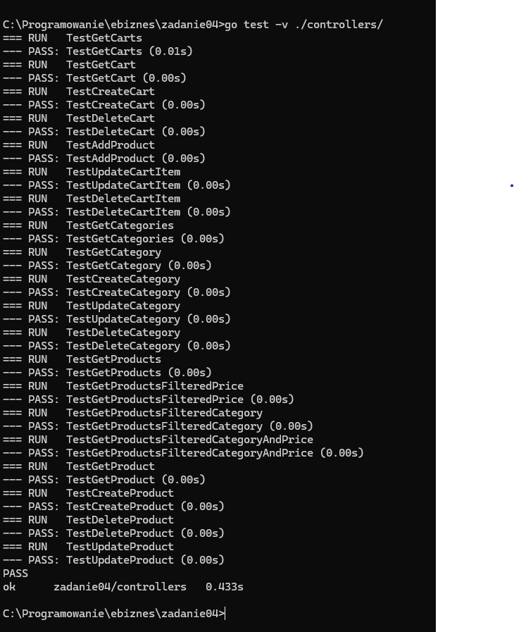
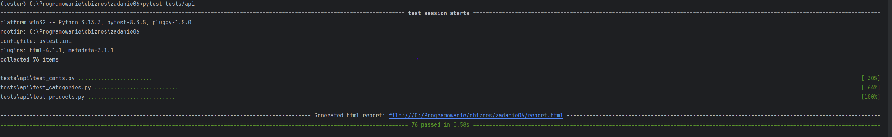

# Testowanie

Testy funkcjonalne zostały zrobione do projektu dostępnego pod adresem:
- https://github.com/noxikoxi/MaszynaNaDzien

Commit:
- https://github.com/noxikoxi/ebiznes/commit/14f62b89b2a7a21efad54eac4a003e082056ba5a

[Raport testów](selenium_results.html)

Testy jednostkowe i api dla projektu:
- https://github.com/noxikoxi/ebiznes/tree/main/zadanie04

Commit testów jednostkowych:
- https://github.com/noxikoxi/ebiznes/commit/c1a6880f58a8bb0d4030e241e2f16c8ff7106ea9

Wyniki testów jednostkowych:

Wyniki testów api:

[Raport testów](api_tests_report.html)

### BrowserStack

Aby uruchomić testy na browserstack należy stworzyć i uzupełnić plik konfiguracyjny `browserstack.yml`.
Uzupełnić w nim username oraz access key.

W pliku `conftest.py` zmienna `LOCAL` musi być ustawiona na *False*.

Jeżeli będzie ustawiona na *True* to testy zostaną wykonane lokalnie.

Link do testów na browserstack:
- https://automate.browserstack.com/dashboard/v2/public-build/UXlPb1Qvd0V6TFJHa0tmaXBneFBHSlhYVFBraFJQclp6UEU4dExqeXZDVzdJc2tmS3NvRDU5Z0xneVJhVm5hT3lEam9WOXcyczB1d0Q5TzE3dSsxUXc9PS0tMzhzT2dYSW1lbXJsSURpaEpreHNGZz09--de46f799f0295f07b768eb0268d93fa026650b03

