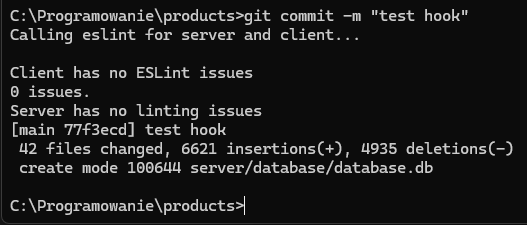
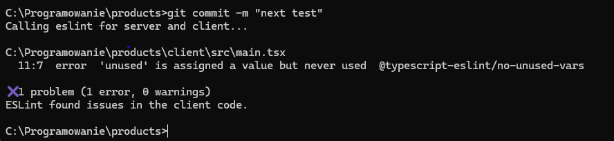
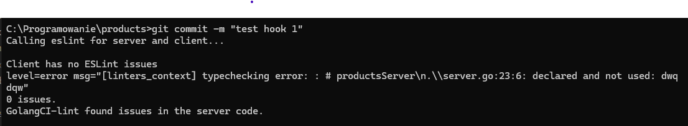

Wszystko ok

Commit widoczny -> https://github.com/noxikoxi/products/commit/77f3ecd1f34b002c871717ac05b97c3501722f18

Błąd w aplikacji klienckiej, brak commitu.

Błąd w aplikacji serwera, brak commitu.

link do kodu aplikacji -> https://github.com/noxikoxi/products

### Badge

