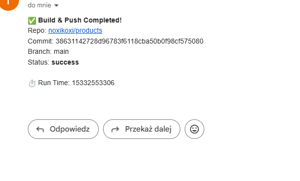
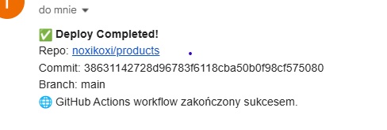

Zadanie wykonanie dla repozytorium:
- https://github.com/noxikoxi/products

Chmura Microsoft Azure

Frontend dostępny pod adresem:
- https://products-frontend-eebnfzhnergdfsax.polandcentral-01.azurewebsites.net

Github Actions buduja obrazy docker, pushuja na dockerhuba a następnie resetują kontenery na chmurze, które pobierają nowy obraz.
Informacja mailowa po pushu na dockerhuba oraz po zresetowaniu aplikacji.

